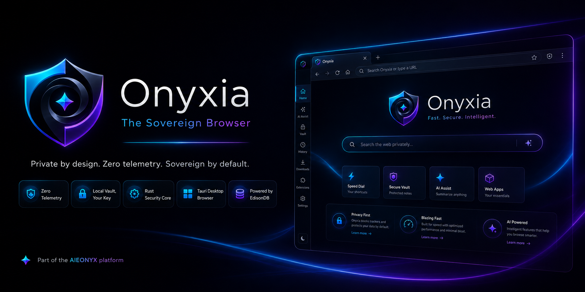

<p align="center">
  
</p>

# Onyxia

**The Sovereign Browser.**

Onyxia is a desktop web browser designed for individuals who choose not to be tracked, profiled, or treated as mere data points. It is part of the AIEONYX platform, a digital infrastructure built on the belief that every person is in control of their own digital existence. 


---

## What makes Onyxia different

Most browsers operate under the idea that your browsing data is something to collect and exploit. Onyxia starts from a different perspective: your data is yours, it stays on your device, and it only leaves when you decide.

| Feature | Legacy Browser | Onyxia |
|---------|---------------|--------|
| Password storage | Cloud-synced, vendor-controlled | Local vault, your key |
| Autofill | Filled silently from remote servers | Requires explicit sovereign confirmation |
| Identity | Tracked via cookies, fingerprinting | Sovereign identity via AIEONYX protocol |
| Certificate trust | Browser vendor decides | You decide, with AIEONYX CA support |
| Telemetry | On by default | Zero |

---

## Architecture

Onyxia is built with:

- **[Tauri v2](https://tauri.app)** — Rust backend, WebKitGTK webview on Linux
- **Rust** — all security-critical logic: vault, identity, protocol handling
- **TypeScript** — browser chrome UI only; never touches sensitive data
- **[EdisonDB](https://github.com/aieonyx/edisondb)** — embedded sovereign database for credentials and identity (C8)

### Security model

- All trust state is computed in the Rust main process. The frontend only renders what it is told.
- Credentials never cross the IPC boundary in plaintext.
- The URL bar trust indicator (✶ sovereign, 🔒 HTTPS, ⚠️ insecure) is set by the backend, never by page logic.
- Vault is locked by default. Nothing sensitive is served in locked state.

### Protocol support

- `https://` — standard TLS web, legacy connection mode
- `awp://` — AXON Web Protocol, sovereign mesh routing (AWP mesh: future release)

---

## Track C — Build Milestones

| Milestone | Description | Status |
|-----------|-------------|--------|
| C1 | Tauri v2 shell — browser chrome, tabs, navigation | ✅ Complete |
| C2 | AIEONYX CA pre-installation | 🔄 In progress |
| C3 | AXON-Client header emission | ✅ Complete |
| C4 | `awp://` protocol handler | ✅ Complete |
| C5 | ARPi status bar, protocol switcher, window controls, tab URL restore | ✅ Complete |
| C6 | Trust indicators (✶, 🔒, ⚠️), tab reorder | ✅ Complete |
| C7 | Sovereign Threat Sensor — tracker detection, SSV typosquat, crypto allowlist | ✅ Complete |
| C8 | EdisonDB session persistence — tab save/restore | ✅ Complete |
| C9 | Password manager UI — vault panel, save banner, master password prompt | ✅ Complete |
| C10 | Digital Legacy integration | 🔄 In progress |
| C11 | Aegis Sovereign Threat Intel UI | Planned |
| C12 | Servo engine swap + v1.0 Linux release | Planned |
| C13 | AXON Integration — AWP verifier in AXON, FFI link into Onyxia | Planned |

---

## Building from source

### Requirements (Linux / Ubuntu / Pop!_OS)

```bash
sudo apt install -y \
  libwebkit2gtk-4.1-dev libssl-dev libgtk-3-dev \
  libayatana-appindicator3-dev librsvg2-dev \
  libsoup-3.0-dev libjavascriptcoregtk-4.1-dev \
  libdbus-1-dev libsecret-1-dev pkg-config \
  build-essential curl
```

Install Rust:
```bash
curl --proto '=https' --tlsv1.2 -sSf https://sh.rustup.rs | sh
```

Install Tauri CLI:
```bash
cargo install tauri-cli --version "^2.0"
```

### Build

```bash
git clone https://github.com/aieonyx/onyxia.git
cd onyxia
npm install
cargo build
```

### Run in development mode

```bash
cargo tauri dev
```

---

## Platform support

| Platform | Status |
|----------|--------|
| Linux (Ubuntu, Pop!_OS, Debian) | ✅ Primary target |
| macOS | Planned — C13+ |
| Windows | Planned — C13+ |

---

## License

Onyxia licensing will be formally defined at v1.0 release.
Core components follow the AIEONYX open-core model.

---

## Part of AIEONYX

Onyxia is one component of the AIEONYX sovereign digital platform:

- **[AXON](https://leanpub.com/axon)** — sovereign programming language and compiler
- **[EdisonDB](https://github.com/aieonyx/edisondb)** — sovereign database
- **Onyxia** — sovereign browser

> *"We are not users. We are not accounts. We are not products. We are people."*

---

*Copyright © 2026 Edison Lepiten / AIEONYX*
